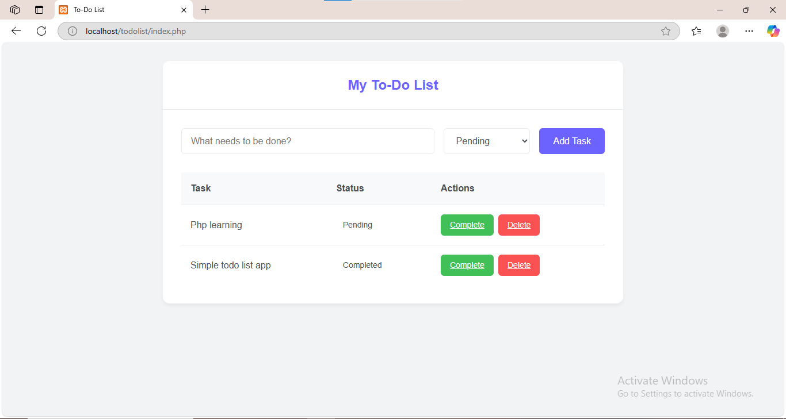

# PHP To-Do List ✅

A simple To-Do List application built using **PHP, MySQL, and XAMPP**.

## 🚀 Features
- Add, view, update, and delete tasks
- Task status: Pending, In Progress, Completed
- Responsive design with clean UI

## 🛠️ Installation Steps
### 1️⃣ Clone the Repository
```bash
git clone https://github.com/omwarkri/Todo-App.git
cd Todo-App
```

### 2️⃣ Set Up the Database
- Open **phpMyAdmin** (http://localhost/phpmyadmin)
- Create a new database: **`todolist_db`**
- Import the `database.sql` file (if available)

### 3️⃣ Configure Database Connection
- Open `config.php` (or edit database credentials in `index.php`)
- Set your MySQL credentials:
```php
$servername = "localhost";
$username = "root";
$password = "";
$database = "todolist_db";
```

### 4️⃣ Start the Server
- Open **XAMPP** and start `Apache` & `MySQL`
- Place the project inside `htdocs` (e.g., `C:\xampp\htdocs\Todo-App`)
- Open in the browser:  
  👉 `http://localhost/Todo-App/`

## 🌍 How to Contribute?
- Fork the repository
- Create a new branch: `git checkout -b feature-name`
- Make changes and commit: `git commit -m "Added new feature"`
- Push to GitHub: `git push origin feature-name`
- Open a Pull Request 🚀

## 📜 License
This project is **open-source**. Feel free to contribute! 🚀

